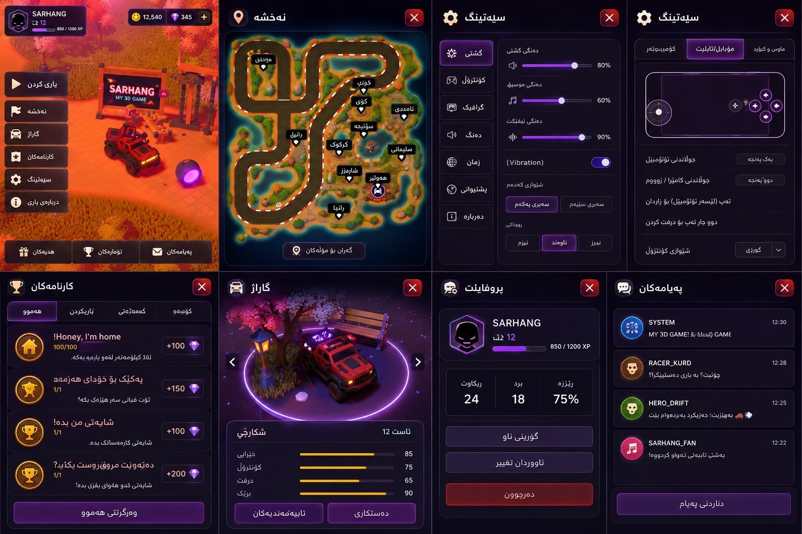

<a id="top"></a>

<div align="center">

# 4X4 COUKOO

### Interactive 3D Driving World

**Developer: Sarhang Salah · SARHANG IO · 2026**


<br />



<br />

[](https://vite.dev/)
[](https://threejs.org/)
[](https://rapier.rs/)
[](./LICENSE)

</div>

---

## Overview

**4X4 COUKOO** is an interactive browser-based 3D driving world created and maintained by **Sarhang Salah** under **SARHANG IO**. The experience combines vehicle movement, world exploration, physics interactions, day-and-night lighting, ambient effects, touch controls, and game-style interface systems in one stylized environment.

The game is designed for mobile, tablet, and desktop browsers. It uses WebGPU when available and selects a lightweight WebGL compatibility path when WebGPU is unavailable.

## Screenshots

| Gameplay world | In-game interface |
| --- | --- |
|  |  |


## 2026 Optimization Update

- Mobile WebGL compatibility rendering now bypasses the expensive post-processing pipeline and caps device pixel ratio for steadier frame time.
- The WebGL fallback selects directly when WebGPU is unavailable, avoiding an unnecessary failed WebGPU initialization attempt.
- A guarded Three.js WebGL uniform-buffer fix is applied at install time for dynamic node buffers.
- Vehicle steering is tighter at low speed and progressively stabilized at higher speed.
- The Kurdistan flag uses a lower-cost animated cloth mesh, a brighter emissive fabric treatment, and a GLB-authored anchor beside the final `G`.
- Unused WAV masters, redundant preview PNGs, and unreferenced duplicate flag files were removed; production images remain WebP/JPEG where appropriate.

## Gameplay Features

- Drive an off-road vehicle through a stylized 3D island.
- Explore landmarks, interactive points, map locations, and environmental details.
- Use touch controls, keyboard and mouse, or a compatible gamepad.
- Open map, garage, achievements, profile, settings, messages, and information panels.
- Experience time-of-day changes, fog, wind, water, lighting, particles, sound, and world interactions.
- Interact with the physical **SARHANG** title landmark and Kurdistan flag landmark.
- Use graphics, audio, camera, vibration, and control options for different devices.

## Technical Stack

| Layer | Technology |
| --- | --- |
| 3D rendering | Three.js with WebGL / WebGPU renderer support |
| Physics | Rapier 3D |
| Build tool | Vite |
| Language | Modern JavaScript modules |
| Animation | GSAP |
| Audio | Howler.js |
| Styling | Stylus |
| Assets | GLB, KTX, PNG, WebP, SVG, WOFF |

## Controls

### Mobile and tablet

| Action | Input |
| --- | --- |
| Drive | On-screen touch controls |
| Camera and zoom | Touch gestures |
| Interact | Nearby interaction prompt |
| Open menus | Interface buttons |

### Keyboard and mouse

| Action | Input |
| --- | --- |
| Drive | `W A S D` or arrow keys |
| Camera | Mouse |
| Interact | `E` or `Enter` |
| Open map | `M` |
| Open menu | `Esc` |

## Run Locally

```bash
git clone https://github.com/sarhang-cs/4x4-COUKOO.git
cd 4x4-COUKOO
npm install
npm run dev
```

Open the local address shown by Vite, usually:

```text
http://localhost:5173
```

## Production Build

```bash
npm run build
npm run preview
```

## Deploy on Vercel

Use these values when importing the repository:

```text
Framework Preset: Vite
Install Command: npm install --no-audit --no-fund
Build Command: npm run build
Output Directory: dist
Node.js Version: 24.x
```

## Project Structure

```text
4x4-COUKOO/
├── scripts/                 Build utilities
├── sources/                 Core game source
│   ├── Game/                Gameplay, physics, rendering, UI, and world systems
│   ├── data/                Game data and content definitions
│   ├── style/               Stylus stylesheets
│   ├── index.html           Application shell and share metadata
│   └── index.js             Application entry point
├── static/                  Models, textures, sounds, fonts, icons, and images
│   └── readme/              GitHub README screenshots
├── package.json             Dependencies and scripts
├── vite.config.js           Vite configuration
├── LICENSE                  MIT license text
└── README.md                Project documentation
```

## Performance Notes

- The first visit can take longer because the game loads 3D models, textures, audio, and shaders.
- A modern browser with hardware acceleration enabled is recommended.
- Mobile WebGL fallback uses a direct rendering path and a reduced pixel ratio to keep frame time stable.
- Use the in-game quality settings on lower-end devices.
- Close unused browser tabs to keep more memory available on mobile devices.

## Game Loop

#### 0

- Time
- Inputs

#### 1

- Player:pre-physics (Inputs)

#### 2

- PhysicalVehicle:pre-physics (Player:pre-physics)

#### 3

- Physics

#### 4

- PhysicsWireframe (Physics)
- Objects (Physics)

#### 5

- PhysicalVehicle:post-physics (Player:pre-physics)

#### 6

- Player:post-physics (Physics, PhysicalVehicle:post-physics)

#### 7

- View (Inputs, Player:post-physics)

#### 8

- Intro
- DayCycles
- YearCycles
- Weather (DayCycles, YearCycles)
- Zones (Player:post-physics)
- VisualVehicle (PhysicalVehicle:post-physics, Inputs, Player:post-physics, View)

#### 9

- Wind (Weather)
- Lighting (DayCycles, View)
- Tornado (DayCycles, PhysicalVehicle)
- InteractivePoints (Player:post-physics)
- Tracks (VisualVehicle)

#### 10

- Area++ (View, PhysicalVehicle:post-physics, Player:post-physics, Wind)
- Foliage (VisualVehicle, View)
- Fog (View)
- Reveal (DayCycles)
- Terrain (Tracks)
- Trails (PhysicalVehicle)
- Floor (View)
- Grass (View, Wind)
- Leaves (View, PhysicalVehicle)
- Lightnings (View, Weather)
- RainLines (View, Weather, Reveal)
- Snow (View, Weather, Reveal, Tracks)
- VisualTornado (Tornado)
- WaterSurface (Weather, View)
- Benches (Objects)
- Bricks (Objects)
- ExplosiveCrates (Objects)
- Fences (Objects)
- Lanterns (Objects)
- Whispers (Player)

#### 13

- InstancedGroup (Objects, [SpecificObjects])

#### 14

- Audio (View, Objects)
- Notifications
- Title (PhysicalVehicle:post-physics)

#### 998

- Rendering


## License

**4X4 COUKOO** is distributed under the MIT License. See [LICENSE](./LICENSE).

## Developer

**Sarhang Salah**  
SARHANG IO  
GitHub: [@sarhang-cs](https://github.com/sarhang-cs)  
Email: [sarhang.pasha123@gmail.com](mailto:sarhang.pasha123@gmail.com)

## Social Links

| Platform | Link |
| --- | --- |
| Facebook | [facebook.com/sarhang721](https://www.facebook.com/sarhang721) |
| Instagram | [instagram.com/sarhang.io](https://www.instagram.com/sarhang.io) |
| YouTube | [youtube.com/@gamepixel1](https://youtube.com/@gamepixel1) |
| Discord | [discord.gg/5JrmtR8wQS](https://discord.gg/5JrmtR8wQS) |
| Twitch | [twitch.tv/sarhangpasha1](https://twitch.tv/sarhangpasha1) |
| TikTok | [tiktok.com/@sarhang.io](https://www.tiktok.com/@sarhang.io) |
| Telegram | [t.me/sarhang_salah](https://t.me/sarhang_salah) |
| WhatsApp | [wa.me/9647501504608](https://wa.me/9647501504608) |
| X | [x.com/PashaSarha1818](https://x.com/PashaSarha1818) |
| Snapchat | [snapchat.com/add/sc.sarhang](https://www.snapchat.com/add/sc.sarhang) |
| LinkedIn | [linkedin.com/in/sarhang-pasha-8a9501351](https://www.linkedin.com/in/sarhang-pasha-8a9501351) |
| GitHub | [github.com/sarhang-cs](https://github.com/sarhang-cs) |
| Behance | [behance.net/sarhangsalah](https://www.behance.net/sarhangsalah) |
| Pinterest | [pin.it/3ejIOES6j](https://pin.it/3ejIOES6j) |

---

<div align="center">

**4X4 COUKOO** · **SARHANG IO** · Drive · Explore · Discover · 2026

[Back to top](#top)

</div>
